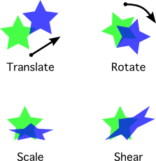

Transform Objects
=================

.. currentmodule:: planar

Transform objects are a mathematical mapping from one coordinate system
to another. The coordinate systems can differ in terms of position (i.e.,
location of the origin), scale, axis direction and relative axis orientation.
Transform objects can be applied to other transforms, vectors, or
shape objects to map them between coordinate systems. 

Transforming between coordinate systems may not, at first glance, appear to
have a lot of practical value.  The value is in realizing that mapping an
object to another coordinate system represented by a transform is equivalent
to transforming the object itself within the same coordinate system.
Typically, it is the object itself we are interested in modifying, and not the
coordinate frame, and linear transforms provide a concise construct for
representing a myriad of possible mutations.

Planar transforms are represented as linear transformation matrices. However,
their interface provides abstractions so that common transformation operations
can be conveniently created and used, without having to worry about the
underlying matrix math.

Affine Transforms
-----------------

Affine transforms in ``planar`` can represent a variety of linear
transformations in 2D space. Specifically, an affine transform can represent
a combination of translation, scale, rotation and shear operations.

Mathematically, an affine transform is one which
preserves parallel aspects when applied. That is, if a shape is transformed by
an affine transformation, points in the shape that define parallel lines in
the original shape, will *always* still define parallel lines in the
transformed shape.

The affine transform's preservation of parallel lines may seem arcane, but it
implies some important limitations, and benefits. Practically speaking it
means that you cannot use an affine transform to create a perspective
projection of a 2D shape. It also means that you cannot use them to twist or
bend the shape like a pretzel. It also means that the implementation can be
more efficient in terms of memory and CPU than a general linear
transformation.

A 2D affine transform is represented by a 3 X 3 transformation matrix.
However, the last row of all affine transformation matrices is the fixed
sequence ``| 0 0 1 |``. Therefore only the first two rows are actually
significant, and need to be stored. Because of this, :class:`~planar.Affine`
objects are stored internally as an array of 6 double-precision floating point
values. Like :class:`~planar.Vec2` objects, :class:`~planar.Affine` objects
are immutable.  Operations that modify a transform always return a new
transform object.

There are a variety of constructors available for :class:`~planar.Affine` objects.
It is typical to use an alternate constructor to create affine transforms,
rather that the default constructor. For example, it is trivial to create the
simplest :class:`~planar.Affine` transform, the identity transform::

	>>> from planar import Affine
	>>> ident = Affine.identity()
	>>> print(ident)
	| 1.00, 0.00, 0.00|
	| 0.00, 1.00, 0.00|
	| 0.00, 0.00, 1.00|

The identity transform always leaves an object unchanged when it is applied.
Printing the :class:`~planar.Affine` instance shows the values in a
conventional matrix grid notation. Since the bottom row is always the same for
all :class:`~planar.Affine` transforms, you can effectively ignore it, but you
can see the obvious diagonal unity values in the identity transform. The first
column can be read as the scale and orientation vector for the X-axis, the
second column as the same vector for the Y-axis, and the third column as the
offset of the origin. Since these vectors are ``(1, 0)``, ``(0, 1)`` and ``(0,
0)`` respectively, in the above, it is easy to see why applying this transform
has no effect.

Another basic transform is a simple translation::

	>>> from planar import Affine
	>>> offset = Affine.translation((5, -1))
	>>> print(offset)
	| 1.00, 0.00, 5.00|
	| 0.00, 1.00,-1.00|
	| 0.00, 0.00, 1.00|

You can see you this is basically the same as the identity transform, except
that the offset of the origin in the third column is now non-zero.

Another simple transform is a scale::

	>>> from planar import Affine
	>>> scale = Affine.scale(2.5)
	>>> print(scale)
	| 2.50, 0.00, 0.00|
	| 0.00, 2.50, 0.00|
	| 0.00, 0.00, 1.00|

The example above applies a scale of 2.5 symmetrically to both axes. If desired,
a different scale can be specified for each axis::

	>>> from planar import Affine
	>>> scale = Affine.scale((0.75, 2))
	>>> print(scale)
	| 0.75, 0.00, 0.00|
	| 0.00, 2.00, 0.00|
	| 0.00, 0.00, 1.00|

When applied, this transform will scale an object to 75% of its original size
in the X-axis and double its size along the Y-axis.

It is also possible to flip an object along an axis by supplying a negative
scaling factor::

	>>> from planar import Affine
	>>> flip_x = Affine.scale((-1, 1))
	>>> print(flip_x)
	|-1.00, 0.00, 0.00|
	| 0.00, 1.00, 0.00|
	| 0.00, 0.00, 1.00|

As you have probably guessed, applying the transform above will flip
an object along the X-axis, mirroring it across the origin.

More sophisticated transforms can modify coordinates in more complex
ways, such as applying rotation::

	>>> from planar import Affine
	>>> rot90 = Affine.rotation(90)
	>>> print(rot90)
	| 0.00, 1.00, 0.00|
	|-1.00, 0.00, 0.00|
	| 0.00, 0.00, 1.00|
	>>> rot45 = Affine.rotation(45)
	>>> print(rot45)
	| 0.71, 0.71, 0.00|
	|-0.71, 0.71, 0.00|
	| 0.00, 0.00, 1.00|

Notice how the 90 degree rotation simply maps the original X coordinates
directly to the Y-axis, and vice versa for Y as you would intuitively
calculate such a rotation yourself. The 45 degree rotation, being halfway
between 0 and 90, mixes the coordinate values from each axis equally. Note the
precision is limited to 2 places in the string representation of a matrix for
easy reading.  The ``repr()`` of a transform instance provides greater
precision, at the cost of some readability.

By default, rotation transforms are performed about the origin. You can
specify another point to rotate around using the optional ``pivot``
argument::

	>>> from planar import Affine
	>>> rot = Affine.rotation(45, pivot=(-3, 8))
	>>> print(rot)
	| 0.71, 0.71, 4.78|
	|-0.71, 0.71, 4.46|
	| 0.00, 0.00, 1.00|

You can see that this includes a translation in the matrix values. You can
use the pivot to rotate an object about its center, or rotate an object
about another object.

The last :class:`~planar.Affine` constructor allows the creation of shear
transforms.  Shears can alter the angle of the X and Y axes relative to one
another::

	>>> from planar import Affine
	>>> shear = Affine.shear(30)
	>>> print(shear)
	| 1.00, 0.00, 0.00|
	| 0.58, 1.00, 0.00|
	| 0.00, 0.00, 1.00|

The above applies a 30 degree shear to the X-axis, and leaves the Y-axis
unchanged. We can also create a shear for both axes::

	>>> from planar import Affine
	>>> shear = Affine.shear(-45, 15)
	>>> print(shear)
	| 1.00, 0.27, 0.00|
	|-1.00, 1.00, 0.00|
	| 0.00, 0.00, 1.00|

A shear transform can alter the shape of an object. For example, shearing a
rectangle results in a parallelogram; shearing a circle results in an
ellipse.

The final way to construct an :class:`~planar.Affine` instance is to use the
default constructor.  This accepts 6 floating point arguments that are
assigned row-wise to the top 2 rows of the transformation matrix. This is
probably only useful if you have a fixed, pre-calculated set of matrix values
that you want to use::

	>>> from planar import Affine
	>>> affine = Affine(0.2, 0.3, 0.4, 0.5, 0.6, 0.7)
	>>> print(affine)
	| 0.20, 0.30, 0.40|
	| 0.50, 0.60, 0.70|
	| 0.00, 0.00, 1.00|

Regardless of how you instantiate :class:`~planar.Affine`, you can access the
values in the matrix as elements of a row-wise sequence::

	>>> len(affine)
	9
	>>> affine[3]
	0.5
	>>> affine[-1]
	1.0

Of course, since affine transforms are immutable, you cannot assign directly
to matrix elements to modify them.

Matrix Multiplication
~~~~~~~~~~~~~~~~~~~~~

Affine transforms can be combined and applied to objects via matrix
multiplication. Combining transforms is powerful, because it allows you
literally combine the effects of multiple different transformations into one.
For example, suppose you have two transforms, a rotation and a scale::

	>>> from planar import Affine
	>>> rot = Affine.rotation(30)
	>>> scale = Affine.scale(2)

You can combine these two transforms into a single one that does both
operations at once by multiplying them::

	>>> rot_and_scale = rot * scale

Multiplying the two transforms performs a matrix multiplication of the
transformation matrices and creates a new affine instance from the resulting
matrix. Note that multiplying two affine transforms always results in an
affine transform, with its parallel-preserving properties. 

It's important to understand that matrix multiplication is not always
commutative, and thus is order-dependant. For example, rotating an object
first and then translating it will return a different result than
performing the translation first and then the rotation.

Inspecting Transforms
~~~~~~~~~~~~~~~~~~~~~

Often when working with transforms, it is useful to inspect them in
terms of certain high-level mathematical properties. These properties
can expose important facts, and limitations of a specific transform.

Boolean properties of :class:`~planar.Affine` instances are exposed in several
``is_*`` attributes. All of these properties can be determined by examining
the transform matrix values directly yourself, but using the built-in property
attributes is more convenient and efficient.

``is_identity`` -- True if the transform is effectively the identity
transform. Identity transforms may be created directly, of course, but
may also be the result of combining inverse transforms, such as a 
scale of ``2.0``, and a scale of ``0.5``.

``is_rectilinear`` -- True if applying the transform would preserve the
axis-alignment of an object. That is, points in a shape that make lines
parallel to the X or Y axis before being transformed, would still make lines
parallel to an axis after being transformed.  Note, that they may not
be parallel to the same axis as before.  Examples of rectilinear transforms
include translation, scale, and rotation in multiples of 90 degrees.

``is_conformal`` -- True if the angles between points within an object
would not change as a result of the transform being applied. This
means that the transform effectively has zero shear.

``is_orthonormal`` -- If True, applying the transform to a shape
would result in a congruent shape with no effective scaling or shear.
Such a transform is also called a "rigid motion" since it does
not squash or stretch the shape. All orthonormal transforms are
conformal, and have a determinant of 1. Thus, they are never degenerate.

``is_degenerate`` -- True if applying the transform to a shape would
reduce its area to zero. This means that the scaling factor of the
transform (i.e., the determinant) is effectively zero. Degenerate transforms
cannot be inverted, because they are "lossy" by completely removing
information in one or both dimensions.

.. note:: 
	All boolean properties of transforms operate within 
	the rounding limits specified by :attr:`planar.EPSILON`. This allows
	them to operate intuitively in the face of floating point
	precision limits.

Two other attributes are available for affine transforms:

``determinant`` -- A scalar floating-point value derived from the transform
that is equal to the overall scaling factor of the transform when applied
to a shape. Mathematically::

	new_area = old_area * abs(determinant)

Note that a determinant will be negative if scaling along one dimension
is negative, usually indicating a flip across an axis. Shear transforms
along both axes will also affect the area of an object, resulting in
a non-unity determinant. Rotation and translation never affect the area
of objects, thus such transforms will always have a determinant of ``1.0``.

If a transform has a determinant of zero, it is considered degenerate.
This means that it effectively "collapses" an object to zero area, losing
information along one or both dimensions as a result. Because of this,
such transforms cannot be inverted.

``column_vectors`` -- A 3-tuple containing the 2D column vectors from
the transformation vector. Since the bottom row of every affine transform
is fixed, the column vectors contain only the top 2 rows. The vectors
define the X-axis, Y-axis, and origin respectively of the transform's 
coordinate system.

Other Operations
~~~~~~~~~~~~~~~~

As you might expect, :class:`~planar.Affine` instances support equality
comparisons.  These simply compare the transformation matrix values directly.
Affine transforms also support an :meth:`Affine.almost_equals` method for
approximate comparison, which is useful to compensate for floating point
precision limits.

Other comparison operations, such as greater or less than are not supported.

The only arithmetic operation supported for :class:`~planar.Affine` transforms is
multiplication. This is because it is the only operation that can guarantee
that the result is also an affine transform.

If a transform is not degenerate, it can be inverted using the unary ``~``
operator (tilde). An inverse transform performs the exact opposite transform
as the original. Multiplying a transform by its inverse, results in the
identity transform::

	T * ~T == Affine.identity() # if not T.is_degenerate

